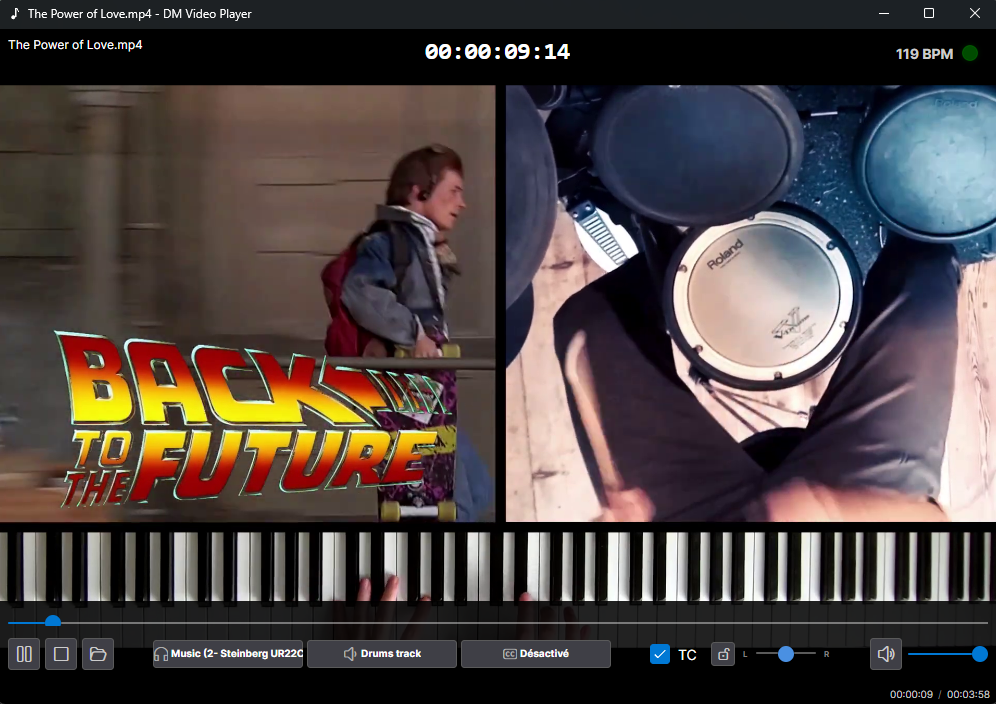

# DM Video Player

🎶 **DM Video Player** is a classic minimalist video player based on VLC. 
It allows you to dynamically add extra audio tracks to your videos, making it especially useful for musicians and those with hearing impairments.

## Author

Created by **Fabrice Deshayes aka Xtream** for its friend [**Didier Martini**](https://didiermartini.com/).

## About the Project

This project is a "vibe coding" experiment, assisted by GitHub Copilot, dedicated to my friend **Didier Martini**, a musician with hearing loss. 
The goal is to provide a video player that can help musicians like Didier by allowing them to isolate and route specific audio tracks (STEMS) for a more accessible and customizable "listening" experience.
Typically, Didier extract drums track (STEM) from vidéo and uses this drum track routed to a separate audio output connected to a vibrating Xbox controller attached to his leg, allowing him to feel the tempo despite his hearing impairment.
This vidéo player allows him to play the keyboard track synchronized to the video he's watching (mainly movie soundtrack) while feeling the tempo/drums through the xbox controller vibrations, even if he can't listen to music anymore.
It can also be useful for other musicians wanting to isolate specific instruments while watching music videos.

### Key Features

- Classic video playback
- Dynamically add extra audio tracks on video load (mainly STEMS extract beforehand from video audio) see "Naming Rules for Audio Tracks" bellow
- Choose audio track to play on which audio outputs
- Choose subtitles to display (or none)
- Toggle timecode display
- Manage Steinberg Cubase Tempo Track *.smt file to display music vidéo tempo (see Naming Rules for Tempo Track below)
- Keyboard shortcuts (0 to stop, space to play/pause)
- Mouse shortcuts (video single click to play/pause, double click to toggle fullscreen))

## Naming Rules for Audio Tracks

- Place your video file and audio STEMS in the same directory.
- Name your extra audio tracks using the following pattern: `<VideoFileNameWithoutExtension>_<stem_name>.<audio_extension>`  
- For example, if your video is `concert.mp4`, your drum track should be named `concert_drums.wav` or `concert_drums.mp3`.
- <stem_name> can be whatever you want and will be used as audio track name.

## Namine Rules for Tempo Track (steinberg Cubase *.smt file)

- Place your smt file in the same directory as the video
- Name it with the same name as the video file (except extension)
- that's it !

### Supported Audio/Video Formats

All that is supported by VLC media player!

## Open Source Components Used

This project leverages the following open source libraries:

- [AvaloniaUI](https://github.com/AvaloniaUI/Avalonia) - Cross-platform .NET UI framework
- [LibVLCSharp](https://github.com/videolan/libvlcsharp) - .NET/Mono bindings for libVLC